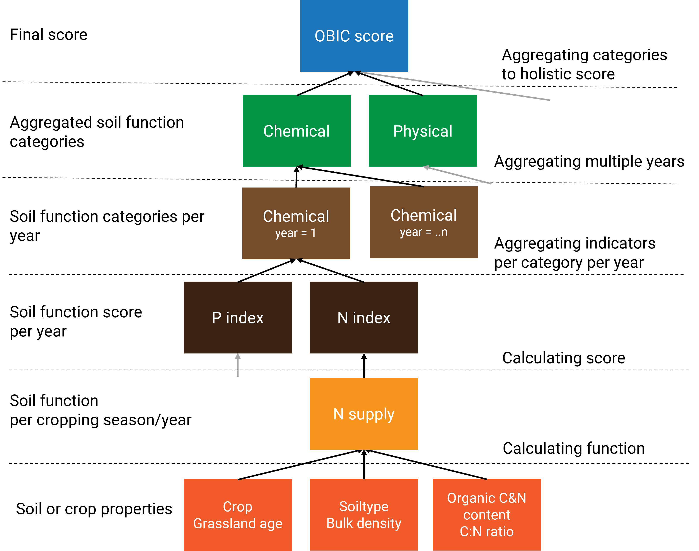

```{r setup, include=FALSE}

  # load packages
  require(euosi); require(data.table)

  # general settings
  knitr::opts_chunk$set(echo = TRUE)
  knitr::opts_chunk$set(collapse = TRUE,comment = "#>")
  options(rmarkdown.html_vignette.check_title = FALSE)
  
  # to run manually
  # devtools::load_all()
```


# Introduction
The euosi is a framework that takes a multitude of soil parameters and variables from agricultural fields and ultimately gives a single value expressing the soil quality of that field, following the methodology developed by [Ros et al. (2022)](https://pubs.acs.org/doi/10.1021/acs.est.2c04516#) and as implemented in the [OBIC R package](https://agrocares.github.io/Open-Bodem-Index-Calculator/). To take this multitude of measured, modeled and calculated values to a single value between 0 and 1, representing a holistic score for the soil health, three aggregation steps take place as illustrated below (source: OBIC).

<br>

```{r include score integration image, echo=FALSE, out.width = '85%', out.height = '85%', fig.cap = 'Figure 1. Graphic representation of how measured soil properties are aggregated to scores.'}
# include graphic
if(file.exists('vignettes/obic_score_integratie.png')){
  knitr::include_graphics('vignettes/obic_score_integratie.png')
} else if(file.exists('../vignettes/obic_score_integratie.png')){
  
}

```

There is no scientific principle dictating how this aggregation should be done and there are several ways to do the aggregation. For example; averaging, linearly weighted averaging, logarithmically weighted averaging. The last one is used in `OBIC` and also in the `euosi` package.
This vignette dives deeper into the three aggregation steps within the framework and will explain  why logarithmically weighted aggregation is chosen. 
<br>
<br>

# Aggregation
## Pre-processing
After calculating soil function scores and in prior to the aggregation procedure, a reformatting step takes place. The reformatting step consists of the following tasks:

  * it is assessed which indicators are relevant for a field given its soil type and crop category using a fixed table hard coded (for the moment) in `osi_field` (lines 251-254).
  * year numbers are assigned from 1 to n with one being the most recent year (used later for the aggregation over years)
  * a molten data.table is created with all indicators in a single column and soil type, crop category and year as identifying variables
  * indicators are assigned to  categories (chemical, physical, biological, environment)
  * the number of indicators per category is counted (used later for the aggregation over categories)
  * a correction factor per score is calculated based on the height of the score (used later for the aggregation within each category)
  * soil function scores irrelevant to the land use are set to -999
  
This procedures is coded inside `osi_field` function, and illustrated below.
  
```{r reformatting code, echo = TRUE, eval=FALSE}
  
  # Step 3 Reformat dt given weighing per indicator and prepare for aggregation  ------------------
    
    # make a data.table for indicators that are not relevant for aggregation for a given crop
    # in this example: wind erosion has no impact on soil loss when grassland is there
    # a negative weight value excludes this indicator from the aggregation process
    w <- data.table(crop_cat1 = c('grasland'),
                    indicator = c('i_p_wef'),
                    weight = c(-1))
    
    # select all indicators used for scoring, only for I_C, I_P, I_B and I_B
    cols <- colnames(dt)[grepl('^ID$|^i_c|^i_p|^i_b|^i_e|year|crop_cat1',colnames(dt))]
    
    # melt dt and assign main categories for OBI
    dt.melt <- melt(dt[,mget(cols)],
                    id.vars = c('year', 'ID','crop_cat1'),
                    variable.name = 'indicator')
    
    # remove the indicators that have a NA value
    dt.melt <- dt.melt[!is.na(value)]
    
    # add main categories relevant for aggregating
    dt.melt[grepl('^i_c|^i_p|^i_b',indicator), cat1 := 'ess_prod']
    dt.melt[grepl('excess',indicator), cat1 := 'ess_env']
    dt.melt[grepl('nleac|water',indicator), cat1 := 'ess_env']
    dt.melt[grepl('carbon',indicator), cat1 := 'ess_env']
    
    # add sub categories relevant for aggregating
    dt.melt[grepl('^i_c',indicator), cat2 := 'chemistry']
    dt.melt[grepl('^i_p',indicator), cat2 := 'physics']
    dt.melt[grepl('^i_b',indicator), cat2 := 'biology']
    dt.melt[grepl('excess',indicator), cat2 := 'nutcycle']
    dt.melt[grepl('nleac|water',indicator), cat2 := 'water']
    dt.melt[grepl('carbon',indicator), cat2 := 'climate']
    
    # Determine amount of indicators per (sub)category
    dt.melt.ncat <- dt.melt[year==1][,list(ncat = .N),by = .(ID, cat1,cat2)]
    
    # add weighing factor to indicator values
    dt.melt <- merge(dt.melt,
                     w[,list(crop_cat1,indicator,weight)],
                     by = c('crop_cat1','indicator'), all.x = TRUE)
    
    # calculate correction factor for indicator values
    # low values have more impact than high values, a factor 5
    dt.melt[,cf := euosi::cf_ind_importance(value)]
    
    # calculate weighted value for crop category
    dt.melt[,value.w := value]
    dt.melt[weight < 0 | is.na(value),value.w := -999]
    
    
```

## Aggregation within category
The indicators within each category are aggregated to a single score per category (chemical, physical, biological, nutcycle, water and climate) using the correction factor (*vcf*) calculated previously using `cf_ind_importance()`. This correction factor *vcf* gives a higher weight to indicators with a lower score, as:
$$
vcf = 1/(I+0.2)
$$
where *I* is the score of the indicator.
This way, the lowest indicator, supposedly also the most limiting factor for crop production, becomes more important. Consequently, improving a low scoring indicator by 0.1 has a greater impact on the aggregated category score than improving a high scoring indicator by the same amount, making it more worthwhile to invest in the poorest and most limiting indicator.

Subsequently, the score of each category is computed by summing up the weighted values (scaled by the sum of all weights) of all soil indicators within the category:
$$
S =  \sum_{i}(I_{i} \frac{vcf_{i}}{\sum_{i}vcf_{i}})
$$
where *S* is the score of the category, *vcf*<sub>i</sub> is the weighing factor of the indicator *i*, *I*<sub>i</sub> is the score of the indicator *i*. This gives a single score for each of the five indicator categories (chemical, physical, biological, management, and environmental) for a specific year.


```{r echo = TRUE, eval=FALSE}    
    
 # subset dt.melt for relevant columns only
 out.score <-  dt.melt[,list(ID, cat1,cat2, year, cf, value = value.w)]
    
 # calculate weighted average per indicator category per year
 out.score <- out.score[,list(value = sum(cf * pmax(0,value) / sum(cf[value >= 0]))),
                          by = list(ID, cat2,year)]
   
 # for case that a cat has one indicator or one year and has NA
 out.score[is.na(value), value := -999]
```

## Aggregation over years
To account for the entire crop rotation, `euosi` aggregates scores of multiple years. For the aggregation over years, another correction factor *ycf* is used to give more weight to recent years on a logarithmic scale. OBIC set the maximum length of period as 10 years, as crop rotation in the Netherlands are hardly ever longer than 10 years. When data older than 10 years ago is used, then those years get the same weight as 10 years ago.
*ycf* is formulated as:
$$
ycf = ln(12 - min(y, 10))
$$
where *y* is the length of years before the assessment. *y = 1* means the year for which the assessment is conducted for (i.e. the most recent year).

This gives the correction factors for a period of eleven years as follows (from the most recent years to 11 years before):
```{r output year cf}
  # create data
  y <- 1:11
  cf <- log(12 - pmin(10, y))
  cat(round(cf, 3))
```

The most recent year carries about `r round(cf[1]/cf[10],digits =1)` times the weight of the tenth year. Notice that years ten and eleven have the same correction factor value, the minimum *ycf* value for a year is equal to that of year ten.

More priority (weight) is given to recent years because they better reflect the current situation. Additionally, changes in management or soil properties have a more visible effect on the scores in the recent years.

Aggregation of scores over years is done with the following two lines of code. This is analogue to the aggregation procedure within each category as described above (i.e. sum of weighted score, scaled by the sum of all weighing factors).

The aggregation procedure is coded in the following lines.
      
```{r echo = TRUE, eval=FALSE}
            
  # calculate correction factor per year; recent years are more important
  out.score[,cf := log(12 - pmin(10,year))]
  
  # calculate weighted average per indicator category per year
  out.score <- out.score[,list(value = sum(cf * pmax(0,value)/ sum(cf[value >= 0]))), 
                         by = list(ID, cat2)]
    
```

This gives us a single score for each of the indicator categories (chemical, physical, biological, nutcycle, water and climate), without time dimension.

## Aggregation to single OSI score
The scores of indicator categories are aggregated to a single, holistic, OSI score. The category scores are weighed logarithmically based on the number of indicators underlying the category. The number of indicators per category was retrieved previously with the line  
`dt.melt.ncat <- dt.melt[year==1][,list(ncat = .N),by = .(ID, cat1)]`.  
Now its merged with our score data.table.

```{r echo = TRUE, eval=FALSE}
  
# merge out with number per category
  out.score <- merge(out.score,dt.melt.ncat, by=c("ID","cat1"),all.x=TRUE)
```

The correction factor for each category, *ccf*, are computed based on the number of indicators as:

$$
ccf = ln(ncat+1)
$$

where *ncat* is the number of the underlying indicators within the category.
The weights for categories with 1 to 10 indicators are: `r round(log(1:10 +1),2)`. Thus, a category based on 10 indicators affects the total score roughly `r round(log(1:10 +1)[10]/log(1:10 +1)[1],1)` times more than a category based on 1 indicator. The idea behind giving more weight to categories with more underlying indicators sprouts from the idea that such a category is better supported by measurable data and better understood. 
Finally, the total OSI score is calculated by summing up the weighted scores of 5 categories and dividing it by the sum of the weighing factors, in the same way as the other 2 aggregation steps.

This aggregation procedure is coded in the following lines.

```{r echo = TRUE, eval=FALSE}
    
  # calculate weighing factor depending on number of indicators  
  out.score[,cf := log(ncat + 1)]
    
  # calculate total score over all categories
  out.score.total <- out.score[,list(s_euosi_total = round(sum(value * cf / sum(cf[value >= 0])),3)),by= c('ID')]
    
```  

During the aggregation there is just a bit of code to format the names of the scores.
```{r echo = TRUE, eval=FALSE}
    
    # add main categories relevant for aggregating
    dt.melt[grepl('^i_c|^i_p|^i_b',indicator), cat1 := 'ess_prod']
    dt.melt[grepl('excess',indicator), cat1 := 'ess_env']
    dt.melt[grepl('nleac|water',indicator), cat1 := 'ess_env']
    dt.melt[grepl('carbon',indicator), cat1 := 'ess_env']
    
    # add sub categories relevant for aggregating
    dt.melt[grepl('^i_c',indicator), cat2 := 'chemistry']
    dt.melt[grepl('^i_p',indicator), cat2 := 'physics']
    dt.melt[grepl('^i_b',indicator), cat2 := 'biology']
    dt.melt[grepl('excess',indicator), cat2 := 'nutcycle']
    dt.melt[grepl('nleac|water',indicator), cat2 := 'water']
    dt.melt[grepl('carbon',indicator), cat2 := 'climate']
    
    # overwrite names
    setnames(out.score.cat2,
             old = c('biology', 'chemistry', 'climate', 'nutcycle', 'physics', 'water'),
             new = c('s_euosi_prod_b','s_euosi_prod_c','s_euosi_clim',
                     's_euosi_nutcycle','s_euosi_prod_p','s_euosi_water'),
             skip_absent = TRUE)
    
    # overwrite names
    setnames(out.score.cat1,
             old = c('ess_prod','ess_env','ess_climate', 'ess_nutcycle', 'ess_water'),
             new = c('s_euosi_ess_prod','s_euosi_ess_env','s_euosi_ess_clim',
                     's_euosi_ess_nut','s_euosi_ess_water'),
             skip_absent = TRUE)

```

## Brief recap

* Soil functions with low scores gain more weight than ones with high scores because these soil functions are supposed to be more limiting. This makes it more worthwhile (both in reality as for the OBI score) to invest in improving low scores
* Values from recent years count more than values from long ago. Recent years are more reflective of the current situation and it becomes easier to see the effect of changes in management or soil properties in subsequent years
* Categories with more underlying indicators have more weight in determining the total OSI score. This is because these indicators are better understood and supported and may also be more important.
